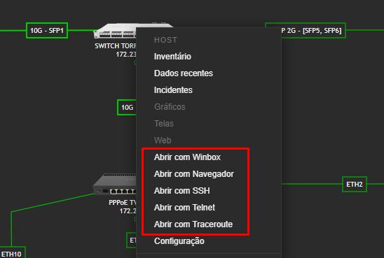
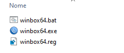
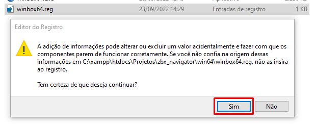

# :rocket: Zabbix Navigator

* [Arquivos Zabbix](#cyclone-arquivos-necessários-no-zabbix)
* [Arquivos Windows](#computer-arquivos-necessários-no-windows)
  * [Acesso Winbox](#configurando-credenciais-de-acesso-para-o-winbox)
  * [Acesso SSH](#configurando-credenciais-de-acesso-para-putty-via-ssh)
  * [Acesso Telnet](#configurando-credenciais-de-acesso-para-putty-via-telnet)
* [Registrando Protocolos](#registrando-os-protocolos)
* [Changelog](#golf-changelog)
* [Dê seu Apoio](#sparkling_heart-nos-ajude-a-crescer)

---
* [Download Versão 1.5.4](https://github.com/nilsonpessim/zabbix-navigator/releases/tag/V1.5.4)
* [Todos as Versões](https://github.com/nilsonpessim/zabbix-navigator/releases)

---

### A customização adiciona novas opções ao menu de acesso a hosts nas páginas de incidentes e também no Mapa.

---
### É necessário reenviar o arquivo `menupopup.js` toda vez que atualizar os pacotes do Zabbix (apt -y upgrade)

---

## :wrench: Funcionalidades
* :large_blue_circle: Acessar hosts MikroTik com Winbox.
* :large_blue_circle: Acessar hosts via SSH com Putty.
* :large_blue_circle: Acessar hosts via Telnet com Putty.
* :large_blue_circle: Acessar hosts via Navegador Web Padrão.
* :large_blue_circle: Acessar hosts via VNC Viewer.
* :large_blue_circle: Testar conectividade IP/Traceroute com WinMTR.
* :large_blue_circle: Copiar IP do host para área de trabalho.

## :heavy_check_mark: Compatibilidade - Testado nas versões:

* :heavy_check_mark: Zabbix Server 7.0 PRE-RELEASE
* :heavy_check_mark: Zabbix Server 6.4 LTS
* :heavy_check_mark: Zabbix Server 6.0 LTS
* :heavy_check_mark: Zabbix Server 5.0 LTS
* :heavy_check_mark: PHP 7 | PHP 8
* :heavy_check_mark: MySQL | PostgreSQL
* :cd: Ubuntu 18.04, 20.04, 22.04 | CentOS 8

---
#### EM CASO DE DÚVIDAS E CORREÇÕES DE ERROS NO PLUGIN, POR FAVOR, ABRE UM ISSUE. TEREMOS O PRAZER EM REALIZAR UMA AVALIAÇÃO E CORRIGI-LOS.
---



## :cyclone: Arquivos necessários no Zabbix
* Antes de enviar os arquivos para o servidor, `é importante realizar o backup do arquivo menupopup.js`, presente na pasta /usr/share/zabbix/js do seu zabbix server, pois o mesmo será substituído pela versão customizada.
* Os arquivos que serão enviados para o servidor são:
```
/usr/share/zabbix/menupopup.php   -> Arquivo de processamento das opções customizadas no Menu.
/usr/share/zabbix/js/menupopup.js -> Arquivo contendo o Menu customizado.
```
* A partir da versão 1.3.1 do Zabbix Navigator, contamos com novos arquivos .js para configurações e controle de idiomas, sendo eles:
```
/usr/share/zabbix/js/menuconfig.js -> Arquivo de Configuração do Menu.
/usr/share/zabbix/js/menulang.js   -> Arquivo de Idiomas do Menu.
```
* A partir da versão 1.5.1 do Zabbix Navigator, contamos com o diretório `plugins`, onde são armazenados os arquivos complementares do menu.
```
/usr/share/zabbix/plugins
```
* Envie os arquivos presentes no diretório `zabbix/*/usr/share/zabbix/` para o servidor Zabbix via FTP, RESPEITANDO OS DIRETÓRIOS. *( * VERSÃO DO SEU ZABBIX)*.

* Reinicie o serviço do Zabbix Server:
```
service zabbix-server restart
```

## :computer: Arquivos necessários no Windows
* Os arquivos são necessários e obrigatórios para que você consiga:
  * Acessar hosts MikroTik utilizando o Winbox.
  * Acessar hosts via SSH utilizando o PuTTY.
  * Acessar hosts via Telnet utilizando o PuTTY.
  * Acessar hosts via RFB utilizando o VNC Viewer.
  * Testar conectividade IP/Traceroute utilizando o WinMTR.
* Copie a pasta zabbix presente em `windows/` para o C:/ do seu computador.
```
O diretório ficará da seguinte forma -> C:/zabbix/
```


--- 

### [IMPORTANTE] Configurar Acessos:
* Para que seu computador seja capaz de abrir o host diretamente no seu respectivo software, é necessário registra-los como protocolo, dentro da pasta `C:/zabbix/reg/`, possuímos o arquivo `Windows.reg` responsável por essa função.
* Além de registrar os protocolos, é possível configurar seu usuário e senha padrão, para que o software já abra o host informando automaticamente as sua credenciais de acesso. ISSO É FANTASTICO!
* A configuração das credenciais é opcional, caso NÃO realize este ajuste, o software selecionado irá tentar conectar ao host utilizando as credenciais padrões que é o `admin/admin`.

--- 

### Configurando credenciais de acesso para o Winbox:
* Abra o arquivo .reg `C:/zabbix/reg/Windows.reg` com o bloco de notas. (Botão direto do mouse -> Editar) Onde admin/admin, altere para o seu login/senha padrão:
```
@="C:\\\\zabbix\\scripts\\Winbox.bat \"%1\" admin admin"
```

---

### Configurando credenciais de acesso para Putty via SSH:
* Abra o arquivo .reg `C:/zabbix/reg/Windows.reg` com o bloco de notas. (Botão direto do mouse -> Editar) Onde admin/admin, altere para o seu login/senha padrão:
```
@="C:\\\\zabbix\\scripts\\SSH.bat \"%1\" admin admin"
```

---

### Configurando credenciais de acesso para Putty via Telnet:
* Abra o arquivo .reg `C:/zabbix/reg/Windows.reg` com o bloco de notas. (Botão direto do mouse -> Editar) Onde admin, altere para o seu login padrão:
```
@="C:\\\\zabbix\\scripts\\Telnet.bat \"%1\" admin"
```

---

### Registrando os Protocolos:
* Após a configuração (ou não) das credenciais no arquivo `Windows.reg`, temos que registrar os protocolos.
* Dê um duplo clique no arquivo `Windows.reg`, e confirme as adição de informações no registro do Windows. 
* *IMPORTANTE*: Esta alteração no registro é OBRIGATÓRIA para que seu computador reconheça o tipos de acesso como protocolos, assim você irá conseguir abrir os hosts.



* Se você chegou até aqui parabéns, o seu computador está pronto para abrir os hosts pela página de incidentes e também pelo mapa.

> Quando abrir um host via Navegador, clique nele com a tecla CONTROL pressionada para abrir em uma nova guia.

---

## :computer: Configurações Extras:
* Por padrão o idioma de exibição do menu é o Portugues.
* Por padrão todas as opções do mapa estão habilitadas.

### Arquivo de Configuração:
* No Arquivo de configurações `js/menuconfig.js` É possível:
  * Habilitar/Desabilitar a customização do menu.
  * Habilitar/Desabilitar as opções individuais.
  * Alterar idioma de exibição do Menu.
```
let enableMenu = true;

let enableWinbox     = true;
let enableNavigator  = true;
let enableSSH        = true;
let enableTelnet     = true;
let enableTraceroute = true;
let enableVNC        = true;
let enableCopy       = true;

let defaultLang = "Portugues";
```
---

### Versão dos Softwares:
* Winbox64: `3.39`
* WinMTR:   `0.92`
* PuTTY:    `0.79`
* VNC: `7.6.0`

--- 

## :golf: Changelog:

* `Versão 1.5.4 - 31/08/2023`
  * Adicionado Suporte a versão 7.0 PRE-RELEASE
  * Adicionado Opção para acesso via Microsoft RDP - `(@andersonmarin)`
  * Atualizado Winbox para versão 3.39
  * Atualizado Putty para a versão 0.79
  * Atualizado VNC para a versão 7.6.0
  * Reformulado a estrutura e posição dos itens do Menu. 
---
* `Versão 1.5.3 - 25/02/2023`
  * Seleção automática do banco de dados (MySQL e PostgreSQL):
    * Melhorias no recurso implementado na versão 1.5.2, na qual a seleção devia ser feita de forma manual no arquivo `menupopup.php`.
  * Atualizado VNC para versão 7.0.1
---
* `Versão 1.5.2 - 05/02/2023`
  * Adicionado Suporte ao PostgreSQL
    * Issue https://github.com/nilsonpessim/zabbix-navigator/issues/4 - `(AlOliveira88)`
---
* `Versão 1.5.1 - 16/12/2022`
  * Adicionado Opção para acesso via RFB com o VNC Viewer - `(Cleto Honorato)`
  * Adicionado Opção para copiar IP do Host. - `(ttamiozzo)`
  * O arquivo Windows.reg foi reformulado.
---
* `Versão 1.4.1 - 08/12/2022`
  * Adicionado suporte para a versão 6.4 PRE-RELEASE
  * Atualizado Putty para versão 0.78
---
* `Versão 1.3.3 - 03/11/2022`
  * Corrigido `ERRO HTTP 500` ao utilizar o Zabbix 6 com PHP 8 no Ubuntu 22.04:
---
* `Versão 1.3.2 - 01/11/2022`
  * Corrigido `ERRO HTTP 500` ao utilizar o sistema operacional CentOS:
    * Issue https://github.com/nilsonpessim/zabbix-navigator/issues/1 - `(Matheus-Boone)`
  * Removido arquivos *_ORIGINAL.js presentes nas pastas JS do projeto.
---
* `Versão 1.3.1 - 30/09/2022`
  * Novas funcionalidades:
    * Possibilidade de Ativar/Desativar o Menu.
    * Possibilidade de Ativar/Desativar os itens do Menu individualmente.
    * Possibilidade de Alterar o idioma do Menu (Português, Ingles, Espanhol).
  * Reformulado a estrutura e posição dos itens do Menu.
  * Grandes melhorias na estrutura de código do arquivo `menupopup.js`.
  * Versão 1.3.1 do Zabbix Navigator é suportada pelo Zabbix 5.0 LTS, 6.0 LTS e 6.2.
---
* `Versão 1.2.2 - 29/09/2022`
  * Adicionado suporte para Zabbix 6.0 LTS.
  * Adicionado suporte para Zabbix 6.2.
---
* `Versão 1.1.1 - 27/09/2022` 
  * Adicionado Opção para acesso via SSH com o PuTTY.
  * Adicionado Opção para acesso via Telnet com o PuTTY.
  * Adicionado Opção para traceroute com o WinMTR.
  * Os arquivos foram organizados dentro da pasta C:/zabbix/.
  * O arquivo .reg foi reformulado para agrupar todos os registros.
  * Os arquivos de script .bat foram reformulados.
  * Revisão e Melhorias em todos os arquivos.
---
* `Versão 1.0.1 - 27/09/2022`
  * Melhorias e Correção de BUGS no arquivo menupopup.php.
---
* `Versão 1.0.0 - 23/09/2022`
  * Adicionado suporte para Zabbix 5.0 LTS.
  * Opção de acesso aos hosts MikroTik via Winbox.
  * Opção de acesso aos hosts via navegador Web Padrão.

## :sparkling_heart: Nos Ajude a Crescer
>Se este Material foi útil para você, ajude se inscrevendo no meu canal do YouTube.
>
>(https://youtube.com/techlabs94?sub_confirmation=1)
> 
>Isso me incentiva a trazer mais materiais como este e muitos outros de redes e tecnologia.
> 
>## 


## :blue_book: Referências e Agradecimentos
> [Zabbix Conference - Jorge Fernando](https://pt.slideshare.net/JorgeFernandoMatsudo/zabbix-conference-2018v2-95430345)

## :iphone: Contato e Informações
[](https://api.whatsapp.com/send?phone=5537999351046)
