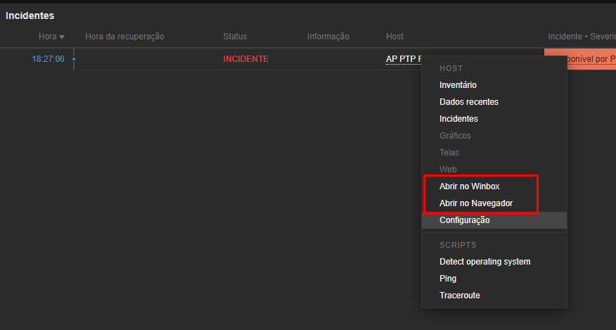

# :rocket: Zabbix Navigator
* :heavy_check_mark: A customização adiciona novas opções no menu de acesso a equipamentos nas página de incidentes e também no Mapa de host.
> TESTADO APENAS NO ZABBIX 5.0, INSTALADO NO UBUNTU 18.04 SERVER.

## :cyclone: Funcionalidades
* Acesso MikroTik via Winbox.
* Acesso via Navegador Web Padrão.




## :cyclone: Arquivos do Zabbix
* Antes de enviar os arquivos para o servidor, é importante realizar o backup do arquivo *menupopup.js*, presente na pasta /usr/share/zabbix/js. Este arquivo será substituído.
* Os arquivos que serão enviados para o servidor são:
```
/usr/share/zabbix/menupopup.php   -> Arquivo de processamento das opções customizadas no Menu.
/usr/share/zabbix/js/menupopup.js -> Arquivo contendo o Menu customizado.
```
* Envie os arquivos *menupopup.php* e *menupopup.js* presentes no diretório *zbx_** para o servidor Zabbix via FTP, respeitando os diretórios. (Selecione os arquivos conforme a versão do seu sistema).
* Reinicie o serviço do Zabbix:
```
service zabbix-server restart
```

## :computer: Arquivos do Windows
* Os arquivos são necessários para que você consiga abrir:
  * Equipamentos MikroTik RouterOS via Winbox.

### Abrir equipamentos MikroTik RouterOS via Winbox:
* Copie os arquivos do diretório *win64* para o C:/ do seu Computador.
* Abra o arquivo *winbox64.reg* com o bloco de notas. Altere *admin admin* para o seu usuário e senha padrão do MikroTik:
```
@="C:\\winbox64.bat \"%1\" admin admin" -> Dessa forma, o Winbox irá logar com as suas credenciais.
```
* Por questões de segurança, ao salvar, será solicitado que salve em outra pasta, dessa forma, selecione a área de trabalho, e logo em seguida mova o arquivo para a pasta C:/

* Os arquivos devem ficar da seguinte forma dentro da pasta:


* Dê um duplo clique no arquivo *winbox64.reg*, e confirme as alterações, este registro é necessário para que seu computador reconheça o Winbox como um protocolo.


* Agora seu PC Windows está pronto para abrir equipamentos pela página de incidentes e também pelo mapa de hosts.
> Segure o botão CONTROL para abrir em uma nova aba do navegador, caso selecione esta opção.

## :apple: Arquivos do macOS:
* `EM BREVE`

## :penguin: Arquivos do Linux Desktop:
* `EM BREVE`

## :golf: Changelog:
* `Versão 1.0.0`
  * Opção de acesso ao equipamento MikroTik via Winbox.
  * Opção de acesso ao equipamento via navegador Web Padrão.

## :sparkling_heart: Nos Ajude a Crescer
>Se este Material foi útil para você, ajude se inscrevendo no meu canal do YouTube.
>
>(https://youtube.com/techlabs94?sub_confirmation=1)
> 
>Isso me incentiva a trazer mais materiais como este e muitos outros de redes e tecnologia.
> 
>## 


## :blue_book: Referências e Agradecimentos
> [Zabbix Conference - Jorge Fernando](https://pt.slideshare.net/JorgeFernandoMatsudo/zabbix-conference-2018v2-95430345)

## :iphone: Contato e Informações
[](https://api.whatsapp.com/send?phone=5537999351046)